# Chalky InfoTech Enterprise Corporate Platform

An enterprise-grade, high-performance, and search-optimized digital ecosystem built for Chalky InfoTech. This platform serves as the global gateway for corporate clients looking to scale their technical workforce and candidates seeking top-tier positions across technology, finance, healthcare, and emerging industries.

---

## 📖 Executive Summary & Brand Purpose

Chalky InfoTech is a premier recruitment and workforce solutions firm operating globally with key regional offices in **London (UK)**, **Chennai (India)**, and **Thoothukudi (India)**. The platform is designed to:
- Connect clients with pre-vetted, high-quality technical talent.
- Streamline candidate applications through an interactive, multi-step CV Upload Wizard.
- Present specialized services (Contract Staffing, Permanent Recruitment, Executive Search) and targeted industry divisions.
- Ensure strict regulatory compliance (GDPR, Right to Work, Background Verification) and high-level corporate governance.

---

## 🛠️ Technology Stack & Core Architecture

The web application is built on a modern, decoupled architecture prioritizing speed, developer productivity, fluid user experience, and search engine discoverability.

### Core Stack
- **Framework**: [Next.js 16.x](https://nextjs.org/) (App Router, utilizing Turbopack)
- **Language**: [TypeScript](https://www.typescriptlang.org/) (Strict type safety across API integrations and data models)
- **Styling**: [Tailwind CSS](https://tailwindcss.com/) (Atomic styling utilizing a tailored brand palette)
- **Animations**: [Framer Motion](https://www.framer.com/motion/) (Hardware-accelerated micro-interactions and page transitions)
- **Icons**: [Lucide React](https://lucide.dev/) (Vibrant, accessible SVG iconography)
- **Database/API layer**: Remote Media Hub Backend (managed via Azure-hosted REST APIs)

### Design & Color Tokens
- **Brand Plum**: `#7A1F5C` (Primary color, used for headers, primary buttons, and corporate branding accents)
- **Brand Cream/Beige**: `#FAF8F5` / `#FDFCFB` (Sleek light-mode backgrounds providing a premium print-media contrast)
- **Brand Rose**: `#C2185B` (Supporting action-color for callouts and state highlights)
- **Muted Grays**: `#8A8A8A` / `#1A1A1A` (Strict typographic hierarchy matching standard enterprise web layouts)

---

## 🗺️ Visual Site Navigation & Information Hierarchy

To ensure maximum transparency for search engine crawlers and users alike, the platform provides a unified navigation flow across static and dynamic paths.

```mermaid
graph TD
    A[Home Page /] --> B[Services /services]
    A --> C[Industries /industries]
    A --> D[Global Locations /locations]
    A --> E[Company /about]
    A --> F[Insights Hub /insights]
    A --> G[Compliance & legal]

    B --> B1[Permanent Recruitment]
    B --> B2[Contract Staffing]
    B --> B3[Executive Search]
    
    C --> C1[Technology & AI]
    C --> C2[Financial Services]
    C --> C3[Healthcare]
    C --> C4[Emerging Verticals]

    D --> D1[London Hub]
    D --> D2[Chennai Hub]
    D --> D3[Thoothukudi Hub]

    E --> E1[Our Story]
    E --> E2[Mission & Vision]
    E --> E3[CSR Initiatives]

    F --> F1[Blogs]
    F --> F2[Case Studies]
    F --> F3[Podcasts]

    G --> G1[GDPR /gdpr]
    G --> G2[Right To Work /right-to-work]
    G --> G3[Privacy Policy /privacy-policy]
    G --> G4[Terms of Use /terms-conditions]
    G --> G5[Cookie Policy /cookie-policy]
    G --> G6[Verification /verification]
    G --> G7[FAQs /faqs]
```



### Visual HTML Sitemap `/sitemap`
The user-facing visual sitemap is mapped dynamically from the application's central data schemas (`SERVICES`, `INDUSTRIES`, `LOCATIONS`, `INSIGHTS_DETAILED`). 
- **5-Column Modern Grid**: Separated into **Company**, **Strategic Services**, **Industry Expertise**, **Global Hubs**, and **Knowledge & Legal**.
- **Dynamic Content Injection**: Renders every single service sub-page, industry vertical, regional hub, detailed blog post, and compliance regulation dynamically.

---

## 📂 Codebase Directory Structure

```text
chalky/
├── .env                              # Production & API environment configurations
├── package.json                      # Dependency manifest and execution scripts
├── tailwind.config.ts                # Brand colors, typography, and animation tokens
├── tsconfig.json                     # TypeScript compiler rules
├── next.config.ts                    # Next.js custom build and image configuration
├── movePdfButton.js                  # Operational automation utility
├── public/                           # Static assets, branding vectors, and team portraits
└── src/
    ├── app/                          # Routing Entry Points (App Router)
    │   ├── layout.tsx                # Base HTML template, global navigation, and modal systems
    │   ├── page.tsx                  # Home landing experience
    │   ├── about/                    # Company details & values
    │   ├── csr/                      # Corporate Social Responsibility overview
    │   ├── contact/                  # Office selection and dynamic client/candidate intake
    │   ├── jobs/                     # CV upload wizard and job boards
    │   ├── services/                 # Strategic service breakdowns
    │   ├── industries/               # Industry sector pages
    │   ├── locations/                # Regional hub specifications
    │   ├── insights/                 # Knowledge base, newsletters, blogs, and RSS
    │   ├── feed.xml/                 # Automated RSS Feed generator (XML)
    │   ├── sitemap/                  # Visual HTML sitemap
    │   ├── sitemap.ts                # Technical XML Sitemap.xml generator
    │   └── robots.ts                 # Crawler directives and search indices
    ├── assets/                       # Statically imported production images (Optimized)
    │   ├── Home/
    │   ├── About Us/
    │   ├── Find Jobs/
    │   ├── Services details page/
    │   └── Insights/
    ├── components/                   # Reusable visual UI blocks
    │   ├── Navbar.tsx                # Dynamic Header Mega-menu and Sitemap gateway
    │   ├── Footer.tsx                # Corporate footer, social links, preferences modal
    │   ├── PageHero.tsx              # Standardized brand header banner
    │   └── CTASection.tsx            # Context-sensitive call-to-actions
    ├── constants/                    # Single Source of Truth database files
    │   ├── index.ts                  # Central exports
    │   ├── servicesData.ts           # Services specifications and slugs
    │   ├── industriesData.ts         # Industries descriptions and segments
    │   └── insightsData.ts           # Core articles, case studies, and insights metadata
    ├── sections/                     # Sub-layout modules organized by route context
    │   ├── home/                     # Global presence, metrics, timelines
    │   ├── contact/                  # Contact forms, interactive map wrappers
    │   ├── jobs/                     # CV Upload wizards, candidate resources
    │   └── about/                    # Leadership team, company milestones
    └── services/                     # Third-party integrations and network clients
        ├── api.ts                    # Backend Media Hub API client
        └── sendmail.ts               # FormSubmit integration with attachment support
```

---

## 📨 Form Intakes & Email Routing Architecture

The platform utilizes a structured, category-based messaging pipeline to route all client inquiries and candidate applications directly to corporate administration.

### Destination Environment Config (`.env`)
```env
NEXT_PUBLIC_FORM_SUBMIT_EMAIL=Sagadevan.S@devopstrioglobal.com
```

### FormSubmit AJAX Integration (`src/services/sendmail.ts`)
Form submissions are handled via a custom fetch helper. It natively supports multipart form data for uploading candidate resume files and JSON payloads for corporate inquiries.

```typescript
export interface EmailData {
  toOverride?: string;
  fullName?: string;
  email: string;
  subject?: string;
  message?: string;
  company?: string;
  serviceType?: string;
  file?: File;
}
```

### Intakes & Category Sorting Triggers
1. **Intake Flow 1: Interactive Contact Wizard (`/contact`)**
   - Routes candidates, clients, and general queries separately.
   - Captures first/last names, cell, email, corporate organization, and detailed messages.
   - Formulates subject patterns: `[Candidate] Contact Form from John Doe` or `[Client] Contact Form from Jane Doe`.
2. **Intake Flow 2: Dynamic CV Upload (`/jobs`)**
   - Implements a dedicated multi-step form requesting Full Name, Email, and a resume attachment (.pdf, .doc, .docx).
   - Dynamically checks the candidate's selected target region (London, Chennai, Thoothukudi) to construct localized routing.
   - Formulates subject patterns: `CV Upload - London Office` or `CV Upload - Chennai Office`.

---

## 📈 Technical SEO & Crawlability Infrastructure

Search Engine Optimization is baked directly into the platform structure to maximize indexation and organic domain authority.

### Dynamic XML Sitemap Generator (`src/app/sitemap.ts`)
Next.js dynamically compiles `sitemap.xml` at runtime. The sitemap dynamically maps:
- Core static paths (`/`, `/about`, `/contact`, `/jobs`, `/sitemap`, etc.).
- Compliance directories (`/privacy-policy`, `/cookie-policy`, `/gdpr`, `/right-to-work`, `/verification`, `/faqs`).
- Dynamic routes by mapping categories and item slugs:
  - `/services/[slug]`
  - `/industries/[slug]`
  - `/locations/[slug]`
  - `/insights/[slug]`

### Live RSS Feed (`src/app/feed.xml/route.ts`)
Maintains a dynamic RSS XML distribution file (`/feed.xml`) mapping new updates directly to web aggregators and Google Indexing APIs.

### Crawler Controls (`src/app/robots.ts`)
Explicit rules defining indexing parameters, prohibiting access to restricted admin paths, and linking directly to the canonical dynamic XML Sitemap:
```text
User-Agent: *
Allow: /
Sitemap: https://chalkyinfo.com/sitemap.xml
```

---

## 📜 Compliance, Accessibility & Document Exports

Enterprise platforms require absolute alignment with digital safety laws and international regulatory protocols. The platform implements specific legal sub-structures:

- **GDPR Compliance**: User data protection guidelines, complete with an interactive Cookie Consent Preferences modal rendered globally at the footer level.
- **Right to Work**: Document requirements and compliance check matrices for UK/India staffing.
- **Background Verification**: Outlines safety screening procedures for corporate talent onboarding.

### Unified "Download as PDF" Capabilities
All legal and compliance documents (`/privacy-policy`, `/terms-conditions`, `/faqs`, `/cookie-policy`, `/gdpr`, `/right-to-work`, `/verification`) integrate a unified PDF Export option:
- **Button Placement**: Positioned at the bottom-right corner of the Hero banner, safely floating above main content areas and avoiding overlaps with the sticky global header navigation.
- **Rendering**: Implements clean typography, preserving the layout structure, table matrix tokens, and company headers when printing or saving to local storage.

---

## 🏗️ Development Setup & Operational Pipeline

Follow these procedures to initialize and test the repository locally:

### 1. Prerequisites
Ensure you have the following environments configured on your workstation:
- **Node.js**: `v20.x` or higher (LTS recommended)
- **Package Manager**: `npm` (packaged with Node)

### 2. Dependency Installation
Initialize package locks and fetch necessary third-party utilities:
```bash
npm install
```

### 3. Execution
Start a Turbopack-optimized hot-reloading local development server:
```bash
npm run dev
```
Open [http://localhost:3000](http://localhost:3000) in your web browser.

### 4. Compiling & Production Bundles
Build a production-optimized compilation:
```bash
npm run build
```
Verify the build results and run the server locally:
```bash
npm run start
```

---

## 🔒 Security & Code Policies

- **Strict Type Checking**: Never compile code with unresolved TypeScript compilation errors or floating `any` variables in core routing endpoints.
- **Client Directives**: Keep Next.js Server Components clean. Always separate stateful interactions into sub-components marked with `'use client';`.
- **Environment Confidentiality**: Never commit API keys, endpoint configurations, or personal SMTP credentials to public Version Control. Maintain all deployment configurations inside `.env` or system variables.

---

*Proprietary and confidential to Chalky InfoTech Ltd. All rights reserved.*
